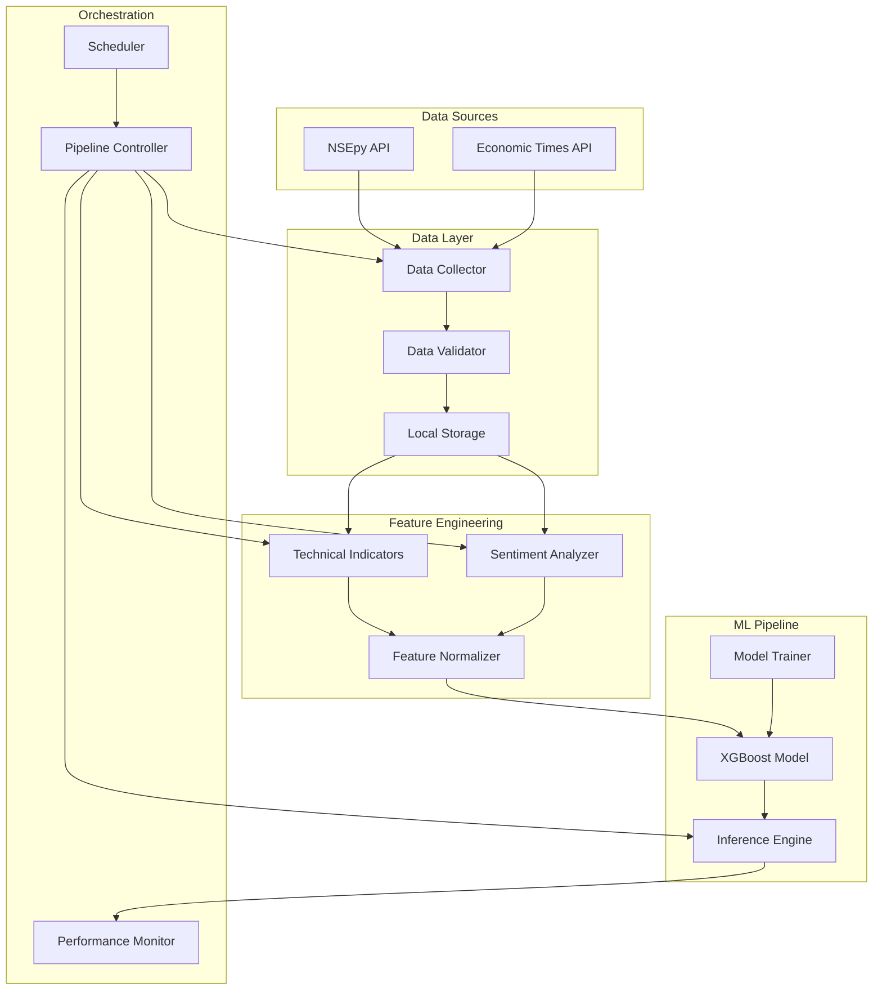

# Design Document

## Overview

The NIFTY 50 ML Pipeline is designed as a modular, CPU-optimized system that integrates multiple data sources to generate real-time trading predictions. The architecture prioritizes computational efficiency, maintainability, and scalability while operating under strict CPU-only constraints. The system follows a pipeline pattern with clear separation of concerns across data ingestion, feature engineering, model training, and inference stages.

The core design philosophy emphasizes:
- **Efficiency First**: All components are optimized for CPU execution with sub-10ms inference targets
- **Modularity**: Each component can be developed, tested, and deployed independently
- **Reliability**: Robust error handling and graceful degradation ensure system stability
- **Maintainability**: Clean interfaces and comprehensive logging facilitate ongoing maintenance

## Architecture

### High-Level System Architecture



### Component Interaction Flow

The system operates through a sequential pipeline where each stage processes data and passes results to the next stage:

1. **Data Collection Stage**: Retrieves historical prices and news data
2. **Validation Stage**: Ensures data quality and completeness
3. **Feature Engineering Stage**: Computes technical indicators and sentiment scores
4. **Model Stage**: Generates predictions using trained XGBoost model
5. **Output Stage**: Formats and stores prediction results

## Components and Interfaces

### Data Collection Module

**Purpose**: Handles retrieval and initial processing of financial data from external APIs.

**Key Classes**:
- `NSEDataCollector`: Interfaces with NSEpy for historical price data
- `NewsDataCollector`: Retrieves financial news from Economic Times API
- `DataValidator`: Ensures data quality and completeness

**Interfaces**:
```python
class DataCollector(ABC):
    @abstractmethod
    def collect_data(self, symbol: str, start_date: datetime, end_date: datetime) -> pd.DataFrame:
        pass
    
    @abstractmethod
    def validate_data(self, data: pd.DataFrame) -> bool:
        pass
```

**Key Design Decisions**:
- Uses adapter pattern to support multiple data sources
- Implements retry logic with exponential backoff for API failures
- Caches data locally to reduce API calls and improve reliability

### Feature Engineering Module

**Purpose**: Transforms raw financial data into model-ready features with optimal CPU performance.

**Key Classes**:
- `TechnicalIndicatorCalculator`: Computes RSI, SMA, MACD with O(n) complexity
- `SentimentAnalyzer`: Processes news headlines using VADER
- `FeatureNormalizer`: Standardizes features for model consumption

**Interfaces**:
```python
class FeatureEngineer(ABC):
    @abstractmethod
    def compute_features(self, price_data: pd.DataFrame, news_data: pd.DataFrame) -> pd.DataFrame:
        pass
    
    @abstractmethod
    def normalize_features(self, features: pd.DataFrame) -> pd.DataFrame:
        pass
```

**Performance Optimizations**:
- Pre-computes indicators using vectorized pandas operations
- Implements incremental calculation for real-time updates
- Uses memory-efficient data structures to minimize RAM usage

### Model Training and Inference Module

**Purpose**: Provides CPU-optimized machine learning capabilities with XGBoost.

**Key Classes**:
- `XGBoostPredictor`: Handles model training and inference
- `ModelValidator`: Implements time series cross-validation
- `PerformanceTracker`: Monitors model accuracy and latency

**Interfaces**:
```python
class MLModel(ABC):
    @abstractmethod
    def train(self, X: pd.DataFrame, y: pd.Series) -> None:
        pass
    
    @abstractmethod
    def predict(self, X: pd.DataFrame) -> np.ndarray:
        pass
    
    @abstractmethod
    def evaluate(self, X: pd.DataFrame, y: pd.Series) -> Dict[str, float]:
        pass
```

**CPU Optimization Strategy**:
- XGBoost configured with `n_jobs=1` and `tree_method='exact'`
- Model complexity limited with `max_depth=6` and regularization
- Inference optimized for single-sample predictions

### Pipeline Orchestration Module

**Purpose**: Coordinates execution flow and handles scheduling, monitoring, and error recovery.

**Key Classes**:
- `PipelineController`: Main orchestration logic
- `TaskScheduler`: Manages daily execution timing
- `ErrorHandler`: Implements graceful failure recovery

**Interfaces**:
```python
class PipelineOrchestrator(ABC):
    @abstractmethod
    def execute_pipeline(self) -> PipelineResult:
        pass
    
    @abstractmethod
    def handle_failure(self, error: Exception, stage: str) -> bool:
        pass
```

## Data Models

### Core Data Structures

**PriceData Model**:
```python
@dataclass
class PriceData:
    symbol: str
    timestamp: datetime
    open: float
    high: float
    low: float
    close: float
    volume: int
    
    def validate(self) -> bool:
        return all([
            self.open > 0,
            self.high >= max(self.open, self.close),
            self.low <= min(self.open, self.close),
            self.volume >= 0
        ])
```

**NewsData Model**:
```python
@dataclass
class NewsData:
    headline: str
    timestamp: datetime
    source: str
    sentiment_score: Optional[float] = None
    
    def is_recent(self, days: int = 30) -> bool:
        return (datetime.now() - self.timestamp).days <= days
```

**FeatureVector Model**:
```python
@dataclass
class FeatureVector:
    symbol: str
    timestamp: datetime
    price_features: Dict[str, float]  # OHLCV data
    technical_features: Dict[str, float]  # RSI, SMA, MACD
    sentiment_features: Dict[str, float]  # News sentiment scores
    
    def to_array(self) -> np.ndarray:
        return np.array(list(self.price_features.values()) + 
                       list(self.technical_features.values()) + 
                       list(self.sentiment_features.values()))
```

**PredictionResult Model**:
```python
@dataclass
class PredictionResult:
    symbol: str
    timestamp: datetime
    predicted_direction: str  # 'BUY', 'SELL', 'HOLD'
    confidence: float
    inference_time_ms: float
    
    def is_actionable(self, min_confidence: float = 0.7) -> bool:
        return self.confidence >= min_confidence
```

### Database Schema

The system uses lightweight file-based storage optimized for time series data:

**Historical Data Storage**:
- Format: Parquet files for efficient compression and fast I/O
- Partitioning: By symbol and date for optimal query performance
- Retention: Rolling 1-year window with automatic cleanup

**Model Artifacts Storage**:
- Trained models stored as pickle files with versioning
- Feature scalers and preprocessors stored separately
- Model metadata includes training date, performance metrics, and hyperparameters

## Error Handling

### Error Classification and Recovery Strategies

**Data Collection Errors**:
- **API Timeouts**: Implement exponential backoff with maximum 3 retries
- **Invalid Data**: Log errors and continue with available data sources
- **Network Failures**: Fall back to cached data if available

**Feature Engineering Errors**:
- **Insufficient Data**: Skip indicator calculation and use default values
- **Calculation Errors**: Log warnings and exclude problematic features
- **Memory Issues**: Implement batch processing for large datasets

**Model Errors**:
- **Training Failures**: Revert to previous model version
- **Inference Errors**: Return neutral prediction with low confidence
- **Performance Degradation**: Trigger model retraining workflow

**System-Level Errors**:
- **Resource Exhaustion**: Implement graceful degradation
- **Configuration Errors**: Validate settings at startup
- **Dependency Failures**: Provide clear error messages and recovery instructions

### Logging and Monitoring Strategy

**Structured Logging**:
```python
import logging
import json

class StructuredLogger:
    def __init__(self, name: str):
        self.logger = logging.getLogger(name)
        
    def log_performance(self, stage: str, duration_ms: float, success: bool):
        self.logger.info(json.dumps({
            'event': 'performance_metric',
            'stage': stage,
            'duration_ms': duration_ms,
            'success': success,
            'timestamp': datetime.now().isoformat()
        }))
```

**Key Metrics to Track**:
- Data collection success rates and latencies
- Feature engineering processing times
- Model inference latencies and accuracy
- Pipeline end-to-end execution times
- Memory and CPU utilization

## Testing Strategy

### Unit Testing Approach

**Data Layer Testing**:
- Mock external API responses for consistent testing
- Validate data quality checks with edge cases
- Test error handling for malformed data

**Feature Engineering Testing**:
- Verify technical indicator calculations against known values
- Test sentiment analysis with sample headlines
- Validate feature normalization and scaling

**Model Testing**:
- Test training pipeline with synthetic data
- Validate inference performance and accuracy
- Test model serialization and deserialization

**Integration Testing**:
- End-to-end pipeline testing with historical data
- Performance testing under CPU constraints
- Failure scenario testing and recovery validation

### Performance Testing Framework

**Latency Testing**:
```python
class PerformanceTest:
    def test_inference_latency(self):
        model = XGBoostPredictor()
        features = self.generate_test_features()
        
        start_time = time.perf_counter()
        prediction = model.predict(features)
        end_time = time.perf_counter()
        
        latency_ms = (end_time - start_time) * 1000
        assert latency_ms < 10.0, f"Inference too slow: {latency_ms}ms"
```

**Accuracy Testing**:
- Backtesting on historical data with walk-forward validation
- Comparison against baseline models (random, buy-and-hold)
- Statistical significance testing for performance claims

**Load Testing**:
- Concurrent prediction requests simulation
- Memory usage monitoring under sustained load
- CPU utilization profiling during peak operations

### Continuous Integration Strategy

**Automated Testing Pipeline**:
1. **Code Quality**: Linting, type checking, and style validation
2. **Unit Tests**: Comprehensive test suite with coverage reporting
3. **Integration Tests**: End-to-end pipeline validation
4. **Performance Tests**: Latency and accuracy benchmarks
5. **Security Scans**: Dependency vulnerability checks

**Deployment Validation**:
- Smoke tests on deployed models
- Performance regression detection
- Rollback procedures for failed deployments